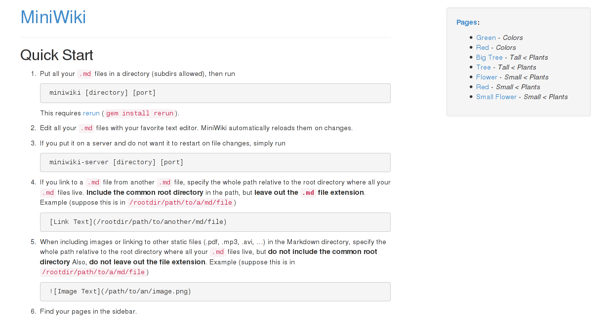

# MiniWiki

MiniWiki is a minimal Markdown-based Wiki. You give it a directory full of
`.md` files and it renders them for you with links to every page.

Here is what you get:

## Installation

        gem install rerun  # <- For auto-reloading.
        gem install miniwiki

## Usage

        miniwiki /path/to/markdown/directory 4321

Then point your favorite browser to `http://localhost:4321`.

From that point on MiniWiki will tell you more itself.

If you do not expect your Markdown files to change (on a server, for
instance), you can also run

        miniwiki-server /path/to/markdown/directory 4321

This will skip the auto-reloading and keep MiniWiki running.

## Good To Know

- Use the file extension `.md`, **not** `.markdown`.
- Static files in the Markdown directory (.png, .gif, .pdf, ...) will be
  served properly. Images are not automatically resized, though (you can
  use your browser for that).
- MiniWiki consists of one single small Sinatra file. So its feature set is
  scarce by design. There are no view files etc.; everything is neatly
  crammed into the `lib/miniwiki/app.rb` file and kept to a minimum.
